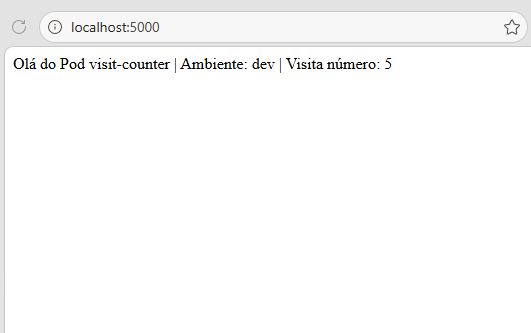
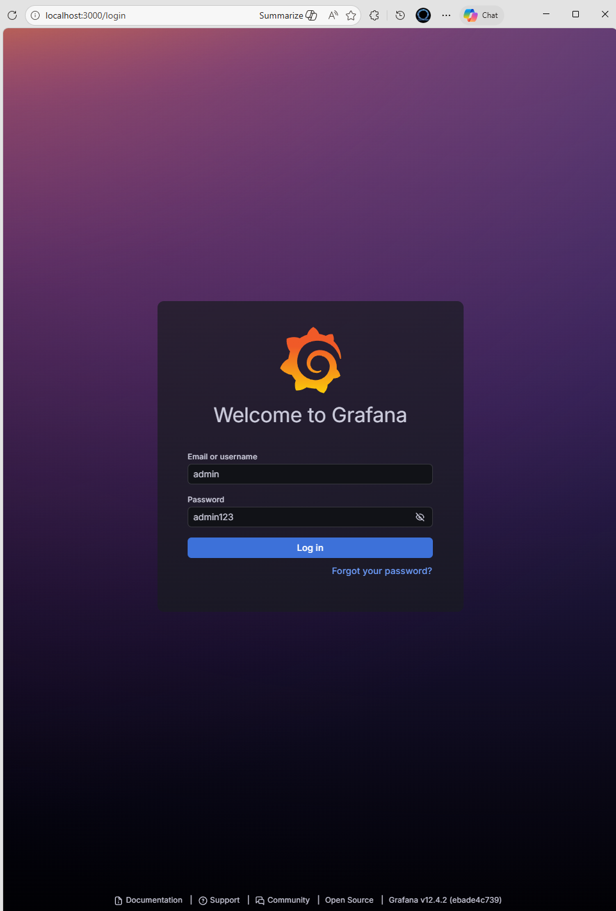
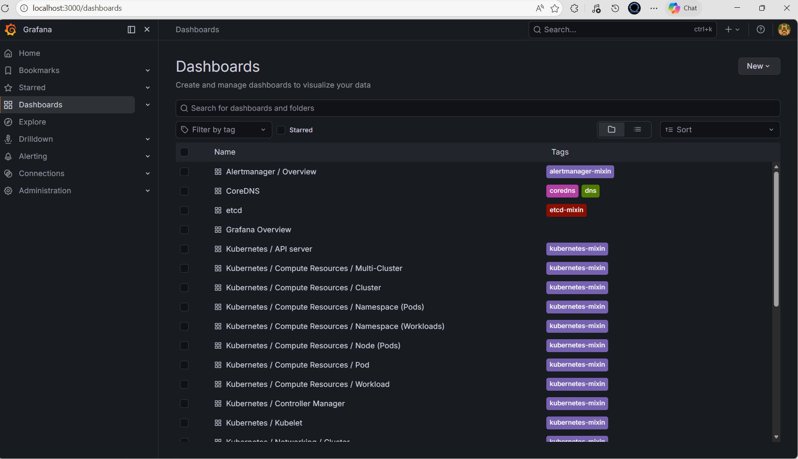
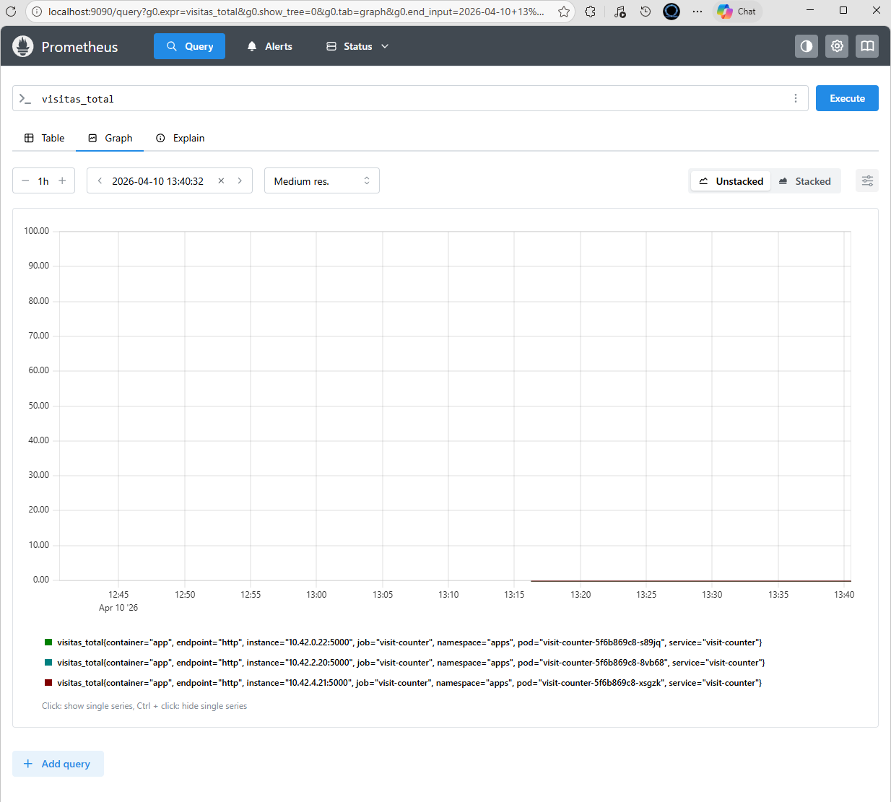
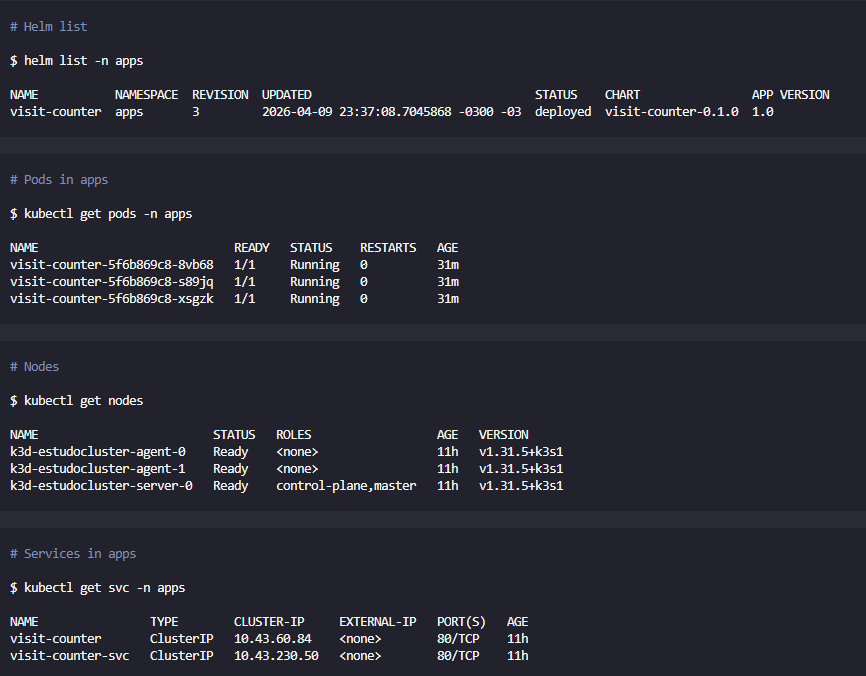
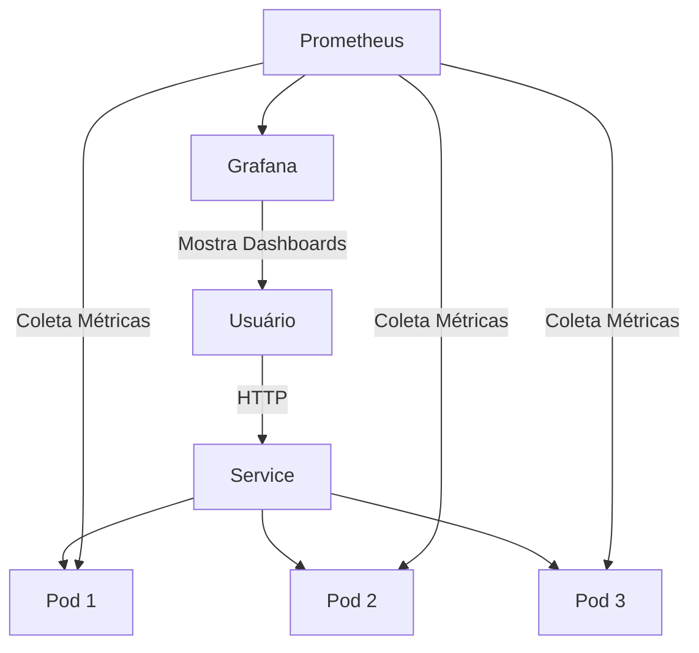

# K8s-Visit-Counter - Projeto de Estudo Kubernetes

## 🌐🇧🇷 [Versão em Português](README.md)
## 🌐🇺🇸 [English Version](README_EN.md)

---

## 📸 Screenshots do Projeto

<div align="center">
  
  
  
  
  
</div>

### 🔐 Credenciais Grafana
- **Usuário:** admin
- **Senha:** admin123

---

## 📚 Documentação Adicional

- **[README_RUN.md](README_RUN.md)** - Como executar o projeto local (passo a passo)
- **[README_ANSIBLE.md](README_ANSIBLE.md)** - Documentação do Ansible
- **[README_TERRAFORM.md](README_TERRAFORM.md)** - Documentação do Terraform
- **[ARCHITECTURE.md](ARCHITECTURE.md)** - Arquitetura do projeto

---

## O que este projeto faz?

Uma API de contador de visitas em Flask que roda em 3 pods simultâneos no Kubernetes, com monitoramento via Prometheus e dashboards no Grafana.

```
┌─────────────────────────────────────────────────────────────┐
│                    ARQUITETURA DO PROJETO                   │
└─────────────────────────────────────────────────────────────┘

                        ┌──────────────┐
                        │   Usuário    │
                        └──────┬───────┘
                               │ http://localhost:5000
                               ▼
┌─────────────────────────────────────────────────────────────┐
│  KUBERNETES (K3d)                                          │
│  ┌─────────────────────────────────────────────────────┐   │
│  │  Service (Load Balancer) - visit-counter:80         │   │
│  │         │              │              │              │   │
│  │    ┌────┴────┐    ┌────┴────┐    ┌────┴────┐        │   │
│  │    │  Pod 1  │    │  Pod 2  │    │  Pod 3  │        │   │
│  │    │ Flask   │    │ Flask   │    │ Flask   │        │   │
│  │    │ :5000   │    │ :5000   │    │ :5000   │        │   │
│  │    └─────────┘    └─────────┘    └─────────┘        │   │
│  └─────────────────────────────────────────────────────┘   │
│                              │                              │
│              ┌───────────────┼───────────────┐             │
│              ▼               ▼               ▼             │
│        ┌─────────┐    ┌──────────┐    ┌──────────┐        │
│        │Prometheus│◄───│ServiceMon│    │Grafana   │        │
│        │ :9090   │    │ itor     │    │ :3000    │        │
│        └─────────┘    └──────────┘    └──────────┘        │
└─────────────────────────────────────────────────────────────┘
```

## 🔨 Funcionalidades do Projeto

- **API Contador de Visitas**: Aplicação Flask que conta visitas por pod
- **3 Réplicas**: Deployment Kubernetes com 3 pods simultâneos
- **Balanceamento de Carga**: Service distribui requisições entre pods
- **Health Checks**: probes de liveness e readiness
- **Métricas Prometheus**: Expostas via endpoint `/metrics`
- **ServiceMonitor**: Descoberta automática de métricas pelo Prometheus
- **Dashboards Grafana**: Visualização do cluster e aplicação
- **Deploy com Helm**: Configuração declarativa Kubernetes
- **Desenvolvimento Local**: Cluster K3d para testes locais

### 📸 Exemplo Visual

```
# Acessar a aplicação
curl http://localhost:5000
# Retorna: "Olá do Pod visit-counter-abc123 | Ambiente: dev | Visita número: 42"

# Ver métricas
curl http://localhost:5000/metrics
# Retorna: # HELP visitas_total Total de visitas na aplicação
# TYPE visitas_total counter
# visitas_total 42
```

## ✔️ Técnicas e Tecnologias Utilizadas

| Tecnologia | Finalidade |
|------------|------------|
| **Python/Flask** | Aplicação web |
| **prometheus-client** | Exportação de métricas |
| **Docker** | Conteinerização |
| **Terraform** | Infraestrutura como Código (AWS) |
| **Ansible** | Automação de configuração |
| **Kubernetes (K3d)** | Orquestração de contêineres |
| **Helm** | Gerenciamento de pacotes |
| **Prometheus** | Coleta de métricas |
| **Grafana** | Visualização |
| **PowerShell** | Automação de scripts |

## 📊 Diagrama Mermaid



## 📁 Estrutura do Projeto

```
K8s-Visit-Counter/
├── docker/                     # Imagem Docker
│   ├── Dockerfile              # Definição da imagem
│   └── requirements.txt         # Dependências Python
│
├── src/                        # Código da aplicação
│   └── app.py                  # App Flask com métricas
│
├── helm/visit-counter/         # Chart Helm
│   ├── Chart.yaml              # Metadados do chart
│   ├── values.yaml             # Configuração
│   └── templates/              # Manifestos K8s
│       ├── deployment.yaml
│       ├── service.yaml
│       ├── ingress.yaml
│       └── servicemonitor.yaml
│
├── monitoring/                 # Configuração de monitoramento
│   └── values-prometheus.yaml
│
├── scripts/                    # Automação (PowerShell)
│   ├── setup-cluster.ps1
│   └── deploy-app.ps1
│
├── terraform/                 # Infraestrutura como Código
│   ├── main.tf                 # Recursos AWS (VPC, EC2)
│   ├── variables.tf            # Variáveis configuráveis
│   └── outputs.tf              # Saídas (IPs, IDs)
│
├── ansible/                   # Automação de Configuração
│   ├── inventory.ini           # Hosts do cluster
│   └── playbook.yml            # Playbook de instalação
│
└── README.md                  # Documentação
```

- **docker/**
  - `Dockerfile`: Container Python 3.11-slim
  - `requirements.txt`: Flask 3.0.0, prometheus-client 0.19.0

- **src/**
  - `app.py`: Aplicação Flask com rotas `/`, `/metrics`, `/health`

- **helm/visit-counter/**
  - `Chart.yaml`: Metadados do chart (versão 0.1.0)
  - `values.yaml`: replicaCount: 3, imagem, service, ingress
  - `templates/deployment.yaml`: 3 réplicas com health probes
  - `templates/service.yaml`: Service ClusterIP
  - `templates/ingress.yaml`: Ingress Traefik
  - `templates/servicemonitor.yaml`: Config de scraping Prometheus

- **monitoring/**
  - `values-prometheus.yaml`: Senha admin Grafana, config Prometheus

- **scripts/**
  - `setup-cluster.ps1`: Cria cluster K3d + instala Prometheus/Grafana
  - `deploy-app.ps1`: Build Docker + deploy Helm

- **terraform/**
  - `main.tf`: Cria VPC, subnets, security groups, instâncias EC2
  - `variables.tf`: Parâmetros region, instance types, etc
  - `outputs.tf`: Retorna IPs públicos das VMs

- **ansible/**
  - `inventory.ini`: Define servidores server e agents
  - `playbook.yml`: Instala Docker, kubectl, helm, k3d, Prometheus

## 🛠️ Abrir e Rodar o Projeto

### Método 1: Local (K3d - Recomendado para estudo)

```powershell
# Instalar ferramentas
scoop install kubectl helm k3d docker

# Setup do cluster
cd scripts
.\setup-cluster.ps1

# Deploy da app
.\deploy-app.ps1
```

### Método 2: Cloud (Terraform + Ansible)

#### Passo 1: Criar infraestrutura com Terraform
```powershell
cd terraform

# Inicializar Terraform
terraform init

# Ver plano
terraform plan -var="ssh_public_key=YOUR_KEY" -var="aws_region=us-east-1"

# Criar recursos
terraform apply -var="ssh_public_key=YOUR_KEY" -var="aws_region=us-east-1"

# Obter IPs dos nodes
terraform output
```

#### Passo 2: Configurar nodes com Ansible
```powershell
cd ansible

# Atualizar inventory com IPs do Terraform
# Edite inventory.ini com os IPs das instâncias

# Executar playbook
ansible-playbook -i inventory.ini playbook.yml
```

#### Passo 3: Deploy da aplicação
```powershell
# SSH para o server node
ssh ubuntu@<server_ip>

# Executar scripts de deploy
cd scripts
./deploy-app.sh
```

### Pré-requisitos (Método 2)

```powershell
# Terraform
scoop install terraform

# Ansible
scoop install ansible

# AWS CLI (para Terraform)
scoop install awscli
aws configure
```

## Comandos Úteis

### Kubernetes (kubectl)
```powershell
# Ver pods
kubectl get pods -n apps

# Ver deployment
kubectl get deployment -n apps

# Ver service
kubectl get svc -n apps

# Ver logs
kubectl logs -n apps -l app=visit-counter

# Acessar Prometheus
# Acessar app
kubectl port-forward -n apps svc/visit-counter 5000:80

# Acessar Grafana
kubectl port-forward -n monitoring svc/monitoring-grafana 3000:80

# Acessar Prometheus
kubectl port-forward -n monitoring svc/monitoring-kube-prometheus-prometheus 9090:9090

# Escalar para 5 réplicas
helm upgrade visit-counter ../helm/visit-counter -n apps --set replicaCount=5

# Deletar cluster
k3d cluster delete estudocluster
```

### Terraform
```powershell
cd terraform

# Inicializar
terraform init

# Ver plano
terraform plan

# Aplicar
terraform apply

# Destruir tudo
terraform destroy

# Ver outputs
terraform output
```

### Ansible
```powershell
cd ansible

# Testar conectividade
ansible -i inventory.ini all -m ping

# Executar playbook completo
ansible-playbook -i inventory.ini playbook.yml

# Executar apenas tasks específicas
ansible-playbook -i inventory.ini playbook.yml --tags "docker,kubectl"
```

## ☁️ LOCAL vs NUVEM - Quando usar cada um

Este projeto tem **duas formas** de rodar:

### Modo 1: LOCAL (K3d) - O que estamos usando ✅

| Componente | Para que serve |
|-----------|---------------|
| **K3d** | Cluster Kubernetes local (dentro de Docker) |
| **kubectl** | Gerenciar o cluster |
| **Helm** | Deploy da aplicação |

**Custo:** Grátis (só precisa do Docker Desktop)

**Ideal para:** Estudo, desenvolvimento, testes

### Modo 2: NUVEM (AWS) - Configurado mas não usado

| Componente | Para que serve |
|-----------|---------------|
| **Terraform** | Criar VPC + VMs na AWS |
| **Ansible** | Instalar Docker + kubectl nas VMs |
| **K3d** | Criar cluster nas VMs |
| **Helm** | Deploy da aplicação |

**Custo:** Cobrado por hora (~$0.05-0.10 por EC2)

**Ideal para:** Produção, aprender cloud

### Qual devo usar?

| Situação | Recomendado |
|---------|-------------|
| Aprendiz | K3d local (grátis) |
| Desenvolvimento | K3d local |
| Testes rápidos | K3d local |
| Produção real | AWS (EKS/GKE) |
| Estudo de Terraform/Ansible | AWS com Terraform |

---

## 🌐 Stack Completa - Onde cada ferramenta se encaixa

Este projeto demonstra a stack completa de DevOps:

```
┌─────────────────────────────────────────────────────────────┐
│  TERRAFORM (Infraestrutura)                                  │
│  Cria: VPC, subnets, security groups, EC2                   │
│  Arquivos: terraform/main.tf, variables.tf, outputs.tf     │
└─────────────────────────────────────────────────────────────┘
                              │
                              ▼
┌─────────────────────────────────────────────────────────────┐
│  ANSIBLE (Configuração)                                      │
│  Instala: Docker, kubectl, helm, k3d, Prometheus            │
│  Arquivos: ansible/inventory.ini, playbook.yml              │
└─────────────────────────────────────────────────────────────┘
                              │
                              ▼
┌─────────────────────────────────────────────────────────────┐
│  KUBERNETES (Orquestração)                                   │
│  Gerencia: Pods, Services, Deployments                     │
│  Arquivos: helm/visit-counter/templates/*.yaml             │
└─────────────────────────────────────────────────────────────┘
                              │
                              ▼
┌─────────────────────────────────────────────────────────────┐
│  HELM (Pacotes)                                              │
│  Instala: Aplicações dentro do K8s                          │
│  Arquivos: helm/visit-counter/Chart.yaml, values.yaml       │
└─────────────────────────────────────────────────────────────┘
                              │
                              ▼
┌─────────────────────────────────────────────────────────────┐
│  DOCKER (Containerização)                                    │
│  Empacota: Aplicação Python                                  │
│  Arquivos: docker/Dockerfile, requirements.txt             │
└─────────────────────────────────────────────────────────────┘
                              │
                              ▼
┌─────────────────────────────────────────────────────────────┐
│  APLICAÇÃO (Código)                                          │
│  Executa: API Flask com métricas Prometheus                 │
│  Arquivos: src/app.py                                        │
└─────────────────────────────────────────────────────────────┘
```

### Fluxo Completo de Deploy

1. **Terraform** → Cria as VMs na AWS
2. **Ansible** → Instala Docker e ferramentas nas VMs
3. **K3d** → Cria o cluster Kubernetes nas VMs
4. **Helm** → Faz deploy da aplicação no K8s
5. **Docker** → Containeriza a aplicação
6. **Aplicação** → Roda o código Python

### Quando usar cada abordagem?

| Abordagem | Quando usar |
|-----------|-------------|
| **scripts/PowerShell** | Desenvolvimento local (K3d) - mais simples |
| **Terraform + Ansible** | Produção em cloud (AWS) - mais robusto |
| **Apenas Helm** | Já tem infraestrutura, só precisa deployar |

## 🌐 Deploy

Este projeto é desenhado para **desenvolvimento local e aprendizado** usando K3d.

Para deploy em produção:
1. Envie a imagem Docker para um registry (Docker Hub, GHCR, etc.)
2. Atualize os valores Helm com o registry de produção
3. Faça deploy em um cluster Kubernetes real (EKS, GKE, AKS, etc.)
4. Configure ingress com certificados TLS

---

## 💻 Código da Aplicação (src/app.py)

Este é o código Flask que roda dentro dos containers.

```python
from flask import Flask, Response
from prometheus_client import Counter, generate_latest, REGISTRY
import os
import socket

app = Flask(__name__)

# Métrica: Contador de visitas (tipo Counter do Prometheus)
visitas = Counter("visitas_total", "Total de visitas na aplicação")

@app.route("/")
def hello():
    visitas.inc()  # Incrementa o contador
    hostname = socket.gethostname()  # Nome do pod
    env = os.getenv("ENV", "dev")  # Variável de ambiente
    return f"Okay do Pod {hostname} | Ambiente: {env} | Visita número: {int(visitas._value.get())}"

@app.route("/metrics")
def metrics():
    # Retorna métricas no formato do Prometheus
    return Response(generate_latest(REGISTRY), mimetype="text/plain")

@app.route("/health")
def health():
    #-health check para Kubernetes
    return "OK", 200

if __name__ == "__main__":
    app.run(host="0.0.0.0", port=5000)
```

### Rotas da Aplicação

| Rota | Descrição | Para que serve |
|------|-----------|---------------|
| `/` | Página inicial | Incrementa contador e mostra mensagem |
| `/metrics` | Métricas Prometheus | Coletado pelo Prometheus |
| `/health` | Health check | Verifica se app está viva |

### Variáveis de Ambiente

| Variável | Padrão | Descrição |
|---------|-------|----------|
| `ENV` | `dev` | Ambiente (dev, prod, etc) |

### Por que /health?

O endpoint `/health` é usado pelas **Health Probes** do Kubernetes:

- **Liveness Probe:** "O container está vivo?" Se `/health` retornar erro, o K8s reinicia o container
- **Readiness Probe:** "O container está pronto para receber requisições?" Se falhar, o container é removido do Service

### Como o Contador Funciona

```python
visitas = Counter("visitas_total", "Total de visitas na aplicação")
```

Cada vez que alguém acessa `/`:
1. `visitas.inc()` incrementa o contador
2. O Prometheus coleta via `/metrics`

**Nota:** Como temos 3 réplicas, cada pod tem seu próprio contador. O Prometheus soma todos.

---

## 🐳 Dockerfile Explicado

```dockerfile
FROM python:3.11-slim          # Imagem base (Python 3.11 leve)
WORKDIR /app                  # Diretório de trabalho
COPY ../docker/requirements.txt .  # Copiar dependências
RUN pip install --no-cache-dir -r requirements.txt  # Instalar
COPY ../src/ .                # Copiar código da app
EXPOSE 5000                  # Porta exposta
CMD ["python", "app.py"]       # Comando para rodar
```

###Por que `python:3.11-slim`?

- **slim** = imagem menor (baixo download)
- **python:3.11** = versão específica do Python

### COPY vs ADD

- `COPY` = copia arquivos simples
- `ADD` = copia ou baixa de URL/tar

---

## 🔄 Image Pull Policy

No Kubernetes, vocêdefine como a imagem é baixada:

```yaml
imagePullPolicy: Always    # Sempre baixa (produção)
imagePullPolicy: IfNotPresent  # Baixa se não existir
imagePullPolicy: Never       # Só usa imagem local (desenvolvimento)
```

**No nosso projeto (K3d local):**
```bash
kubectl run visit-counter --image=visit-counter:latest --image-pull-policy=Never
```

O `--image-pull-policy=Never` evita que o K8s tente baixar do Docker Hub.

---

## 🆚 K3d vs Kubernetes Real

| K3d | K8s Real (EKS/GKE/AKS) |
|------|----------------------|
| Roda em containers | Roda em VMs |
| LoadBalancer não funciona | LoadBalancer funciona |
| Sem cloud integration | Com cloud |
| Para estudo | Para produção |

---

## 📊 Fluxo de Dados Completo

```
Usuário
   │
   ▼
http://localhost:5000
   │
   ▼
┌────────────────┐
│   kubectl      │  ← Port-forward
│   port-forward │
└────────────────┘
   │
   ▼
┌────────────────┐
│   Service      │  ← ClusterIP (falta)
│   (visit-svc)  │
└────────────────┘
   │
   ▼
┌────────────────┐    ┌────────────────┐    ┌────────────────┐
│     Pod 1      │    │     Pod 2      │    │     Pod 3      │
│   app.py:5000  │    │   app.py:5000  │    │   app.py:5000  │
└────────────────┘    └────────────────┘    └────────────────┘
   │
   ▼                    ▼                    ▼
┌────────────────┐
│  Prometheus    │  ← Scrapes /metrics
│  (ServiceMon)  │
└────────────────┘
   │
   ▼
┌────────────────┐
│    Grafana     │  ← Dashboards
└────────────────┘
```

---

## ❓ Perguntas Frequentes (FAQ)

### Por que 3 réplicas?

Más é configurável no Helm:
```bash
helm install visit-counter ./helm/visit-counter --set replicaCount=3
```

### Como mudar a imagem?

```bash
helm upgrade visit-counter ./helm/visit-counter --set image.repository=nova-imagem --set image.tag=v2
```

### Preciso de cloud?

Não! K3d funciona 100% local.

### Quanto custa?

- K3d: Grátis (Docker Desktop)
- AWS: Cobrado por hora

### Posso usar Minikube?

Sim! Mas K3d é mais leve e rápido.

---

## 🔗 Links Úteis

- [Docker Desktop](https://www.docker.com/products/docker-desktop)
- [K3d](https://k3d.io/)
- [Kubernetes: Learn](https://kubernetes.io/pt-br/docs/tutorials/kubernetes-basics/)
- [Helm: Docs](https://helm.sh/pt-br/docs/)
- [Prometheus: Getting Started](https://prometheus.io/docs/prometheus/latest/getting_started/)
- [Grafana: Tutorials](https://grafana.com/tutorials/)

---

**Última atualização**: 2026-04-10  
**Versão do projeto**: 0.1.0  
**Mantenedor**: Felipe Moreira Rios  