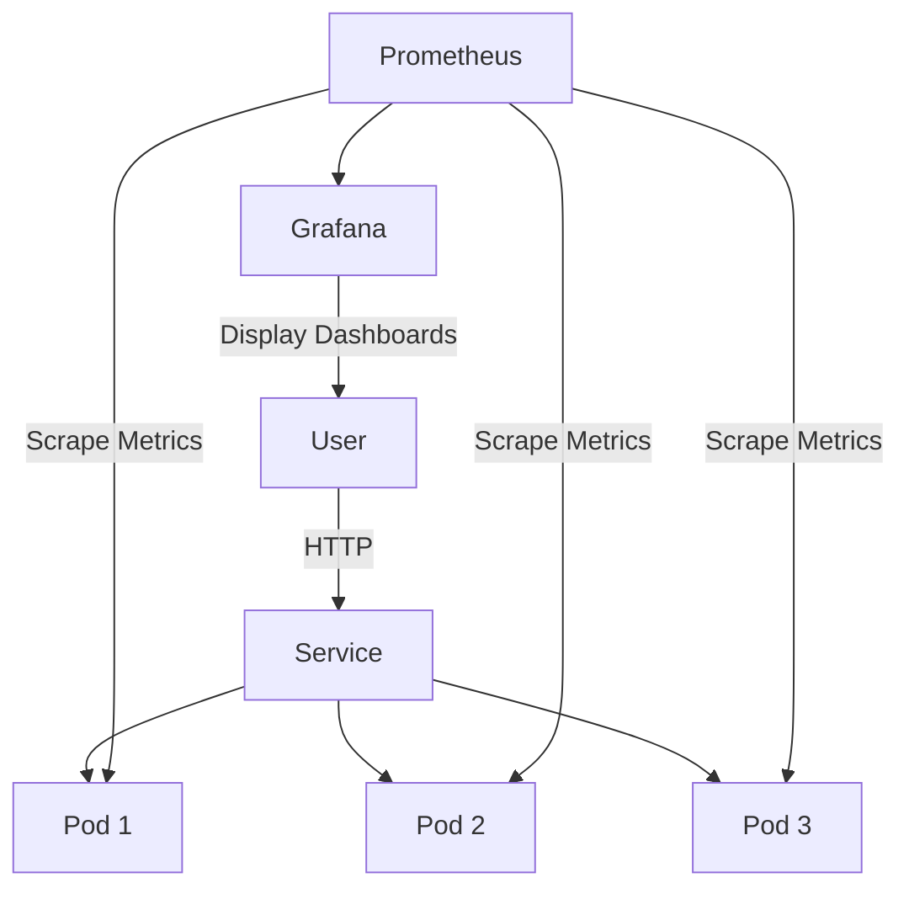

# K8s-Visit-Counter - Kubernetes Study Project

## 🌐🇧🇷 [Portuguese Version](README.md)
## 🌐🇺🇸 [English Version](README_EN.md)

---

# K8s-Visit-Counter

## What does this project do?

A Flask API visit counter that runs on 3 simultaneous pods in Kubernetes, with monitoring via Prometheus and dashboards on Grafana.

```
┌─────────────────────────────────────────────────────────────┐
│                    PROJECT ARCHITECTURE                      │
└─────────────────────────────────────────────────────────────┘

                        ┌──────────────┐
                        │   User       │
                        └──────┬───────┘
                               │ http://localhost:5000
                               ▼
┌─────────────────────────────────────────────────────────────┐
│  KUBERNETES (K3d)                                           │
│  ┌─────────────────────────────────────────────────────┐   │
│  │  Service (Load Balancer) - visit-counter:80         │   │
│  │         │              │              │              │   │
│  │    ┌────┴────┐    ┌────┴────┐    ┌────┴────┐        │   │
│  │    │  Pod 1  │    │  Pod 2  │    │  Pod 3  │        │   │
│  │    │ Flask   │    │ Flask   │    │ Flask   │        │   │
│  │    │ :5000   │    │ :5000   │    │ :5000   │        │   │
│  │    └─────────┘    └─────────┘    └─────────┘        │   │
│  └─────────────────────────────────────────────────────┘   │
│                              │                              │
│              ┌───────────────┼───────────────┐             │
│              ▼               ▼               ▼             │
│        ┌─────────┐    ┌──────────┐    ┌──────────┐        │
│        │Prometheus│◄───│ServiceMon│    │Grafana   │        │
│        │ :9090   │    │ itor     │    │ :3000    │        │
│        └─────────┘    └──────────┘    └──────────┘        │
└─────────────────────────────────────────────────────────────┘
```

## 🔨 Project Features

- **Visit Counter API**: Flask application counting visits per pod
- **3 Replicas**: Kubernetes Deployment with 3 simultaneous pods
- **Load Balancing**: Service distributes requests across pods
- **Health Checks**: Liveness and readiness probes
- **Prometheus Metrics**: Exposed via `/metrics` endpoint
- **ServiceMonitor**: Automatic metrics discovery by Prometheus
- **Grafana Dashboards**: Visual monitoring of cluster and application
- **Helm Deployment**: Declarative Kubernetes configuration
- **Local Development**: K3d cluster for testing locally

### 📸 Visual Example

```
# Access the application
curl http://localhost:5000
# Returns: "Olá do Pod visit-counter-abc123 | Ambiente: dev | Visita número: 42"

# Check metrics
curl http://localhost:5000/metrics
# Returns: # HELP visitas_total Total de visitas na aplicação
# TYPE visitas_total counter
# visitas_total 42
```

## ✔️ Techniques and Technologies Used

| Technology | Purpose |
|------------|---------|
| **Python/Flask** | Web application |
| **prometheus-client** | Metrics export |
| **Docker** | Containerization |
| **Kubernetes (K3d)** | Container orchestration |
| **Helm** | Package management |
| **Prometheus** | Metrics collection |
| **Grafana** | Visualization |
| **PowerShell** | Automation scripts |

## 📊 Mermaid Diagram



## 📁 Project Structure

```
K8s-Visit-Counter/
├── docker/                     # Docker image
│   ├── Dockerfile              # Image definition
│   └── requirements.txt        # Python dependencies
│
├── src/                        # Application code
│   └── app.py                  # Flask app with metrics
│
├── helm/visit-counter/         # Helm chart
│   ├── Chart.yaml              # Chart metadata
│   ├── values.yaml             # Configuration
│   └── templates/              # K8s manifests
│       ├── deployment.yaml
│       ├── service.yaml
│       ├── ingress.yaml
│       └── servicemonitor.yaml
│
├── monitoring/                 # Monitoring config
│   └── values-prometheus.yaml
│
├── scripts/                    # Automation
│   ├── setup-cluster.ps1
│   └── deploy-app.ps1
│
└── README.md                  # Documentation
```

- **docker/**
  - `Dockerfile`: Python 3.11-slim container definition
  - `requirements.txt`: Flask 3.0.0, prometheus-client 0.19.0

- **src/**
  - `app.py`: Flask application with `/`, `/metrics`, `/health` routes

- **helm/visit-counter/**
  - `Chart.yaml`: Helm chart metadata (version 0.1.0)
  - `values.yaml`: Default replicaCount: 3, image, service, ingress configs
  - `templates/deployment.yaml`: 3 replicas with health probes
  - `templates/service.yaml`: ClusterIP service
  - `templates/ingress.yaml`: Traefik ingress
  - `templates/servicemonitor.yaml`: Prometheus scraping config

- **monitoring/**
  - `values-prometheus.yaml`: Grafana admin password, Prometheus config

- **scripts/**
  - `setup-cluster.ps1`: Creates K3d cluster + installs Prometheus/Grafana
  - `deploy-app.ps1`: Builds Docker image + Helm deploy

## 🛠️ How to Run the Project

### Prerequisites

Install the following tools:

```powershell
# Using Scoop (Windows)
scoop install kubectl helm k3d

# Verify installations
kubectl version --client
helm version
k3d version
docker --version
```

### Quick Start

**1. Setup the cluster:**
```powershell
cd scripts
.\setup-cluster.ps1
```

**2. Deploy the application:**
```powershell
.\deploy-app.ps1
```

**3. Test the application:**
```powershell
kubectl port-forward -n apps svc/visit-counter 5000:80
# Open: http://localhost:5000
```

**4. Access Grafana:**
```powershell
kubectl port-forward -n monitoring svc/monitoring-grafana 3000:80
# Open: http://localhost:3000
# Login: admin / admin123
```

## Useful Commands

```powershell
# View pods
kubectl get pods -n apps

# View deployment
kubectl get deployment -n apps

# View service
kubectl get svc -n apps

# View logs
kubectl logs -n apps -l app=visit-counter

# Access Prometheus
kubectl port-forward -n monitoring svc/monitoring-kube-prometheus-prometheus 9090:9090

# Scale to 5 replicas
helm upgrade visit-counter ../helm/visit-counter -n apps --set replicaCount=5

# Delete cluster
k3d cluster delete estudocluster
```

## 🌐 Deploy

This project is designed for **local development and learning** using K3d.

For production deployment:
1. Push Docker image to a container registry (Docker Hub, GHCR, etc.)
2. Update Helm values with production image repository
3. Deploy to a real Kubernetes cluster (EKS, GKE, AKS, etc.)
4. Configure proper ingress with TLS certificates

---

**Last update**: 2026-04-05  
**Project version**: 0.1.0  
**Maintainer**: Felipe Moreira Rios  