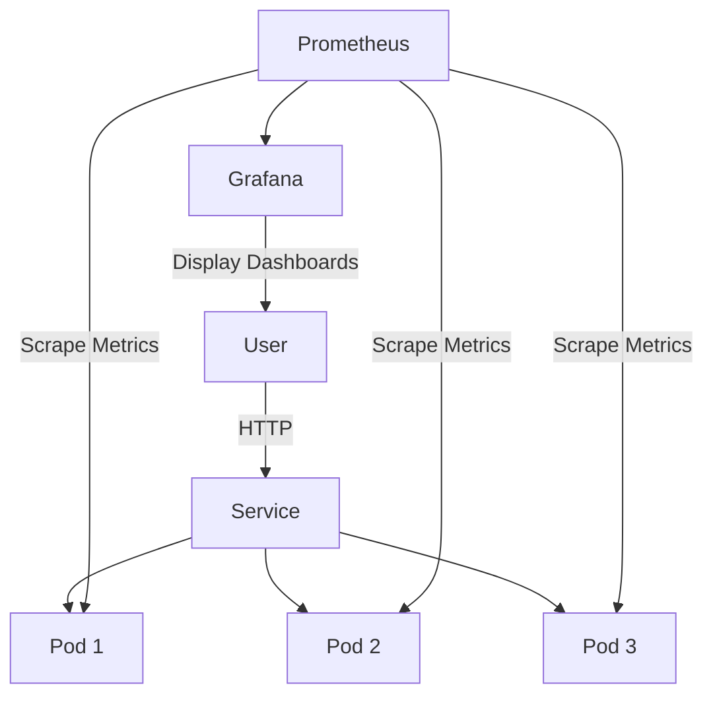

# K8s-Visit-Counter - Kubernetes Study Project

## 🌐🇧🇷 [Portuguese Version](README.md)
## 🌐🇺🇸 [English Version](README_EN.md)

---

## 📸 Project Screenshots

<div align="center">
  
  
  
  
  
</div>

### 🔐 Grafana Credentials
- **User:** admin
- **Password:** admin123

---

## 📚 Additional Documentation

- **[README_RUN.md](README_RUN.md)** - How to run the project locally (step by step)
- **[README_ANSIBLE.md](README_ANSIBLE.md)** - Ansible documentation
- **[README_TERRAFORM.md](README_TERRAFORM.md)** - Terraform documentation
- **[ARCHITECTURE.md](ARCHITECTURE.md)** - Project architecture

---

# K8s-Visit-Counter

## What does this project do?

A Flask API visit counter that runs on 3 simultaneous pods in Kubernetes, with monitoring via Prometheus and dashboards on Grafana.

```
┌─────────────────────────────────────────────────────────────┐
│                    PROJECT ARCHITECTURE                      │
└─────────────────────────────────────────────────────────────┘

                        ┌──────────────┐
                        │   User       │
                        └──────┬───────┘
                               │ http://localhost:5000
                               ▼
┌─────────────────────────────────────────────────────────────┐
│  KUBERNETES (K3d)                                           │
│  ┌─────────────────────────────────────────────────────┐   │
│  │  Service (Load Balancer) - visit-counter:80         │   │
│  │         │              │              │              │   │
│  │    ┌────┴────┐    ┌────┴────┐    ┌────┴────┐        │   │
│  │    │  Pod 1  │    │  Pod 2  │    │  Pod 3  │        │   │
│  │    │ Flask   │    │ Flask   │    │ Flask   │        │   │
│  │    │ :5000   │    │ :5000   │    │ :5000   │        │   │
│  │    └─────────┘    └─────────┘    └─────────┘        │   │
│  └─────────────────────────────────────────────────────┘   │
│                              │                              │
│              ┌───────────────┼───────────────┐             │
│              ▼               ▼               ▼             │
│        ┌─────────┐    ┌──────────┐    ┌──────────┐        │
│        │Prometheus│◄───│ServiceMon│    │Grafana   │        │
│        │ :9090   │    │ itor     │    │ :3000    │        │
│        └─────────┘    └──────────┘    └──────────┘        │
└─────────────────────────────────────────────────────────────┘
```

## 🔨 Project Features

- **Visit Counter API**: Flask application counting visits per pod
- **3 Replicas**: Kubernetes Deployment with 3 simultaneous pods
- **Load Balancing**: Service distributes requests across pods
- **Health Checks**: Liveness and readiness probes
- **Prometheus Metrics**: Exposed via `/metrics` endpoint
- **ServiceMonitor**: Automatic metrics discovery by Prometheus
- **Grafana Dashboards**: Visual monitoring of cluster and application
- **Helm Deployment**: Declarative Kubernetes configuration
- **Local Development**: K3d cluster for testing locally

### 📸 Visual Example

```
# Access the application
curl http://localhost:5000
# Returns: "Olá do Pod visit-counter-abc123 | Ambiente: dev | Visita número: 42"

# Check metrics
curl http://localhost:5000/metrics
# Returns: # HELP visitas_total Total de visitas na aplicação
# TYPE visitas_total counter
# visitas_total 42
```

## ✔️ Techniques and Technologies Used

| Technology | Purpose |
|------------|---------|
| **Python/Flask** | Web application |
| **prometheus-client** | Metrics export |
| **Docker** | Containerization |
| **Terraform** | Infrastructure as Code (AWS) |
| **Ansible** | Configuration automation |
| **Kubernetes (K3d)** | Container orchestration |
| **Helm** | Package management |
| **Prometheus** | Metrics collection |
| **Grafana** | Visualization |
| **PowerShell** | Automation scripts |
| **Gitleaks** | Secrets detection |
| **Bandit** | Python static analysis (SAST) |
| **Trivy** | Vulnerability scanner |
| **Checkov** | IaC/Kubernetes scanning |
| **Dependabot** | Auto-update dependencies |

---

## 🔒 DevSecOps Pipeline

This project includes a complete DevSecOps security pipeline:

### Integrated Tools

| Tool | Type | Description |
|------|------|-------------|
| **Gitleaks** | Secrets | Detects leaked secrets in code |
| **Bandit** | SAST | Python static code analysis |
| **Trivy** | SCA/Docker | Vulnerability scanner for dependencies and images |
| **Checkov** | IaC | Kubernetes manifests and Dockerfiles validation |
| **Dependabot** | Auto-update | Automatic dependency updates |

### GitHub Actions

```yaml
# .github/workflows/security.yml
name: Security Scan

on: [push, pull_request]

jobs:
  security:
    runs-on: ubuntu-latest
    steps:
      - uses: actions/checkout@v4
      - name: Run Gitleaks
        uses: gitleaks/gitleaks-action@v2
      - name: Run Bandit
        run: pip install bandit && bandit -r .
      - name: Run Trivy
        uses: aquasecurity/trivy-action@master
      - name: Run Checkov
        run: pip install checkov && checkov -d helm/
```

### Pre-commit Hooks

```yaml
# .pre-commit-config.yaml
repos:
  - repo: https://github.com/gitleaks/gitleaks
    rev: v8.18.2
    hooks:
      - id: gitleaks
  - repo: https://github.com/PyCQA/bandit
    rev: 1.7.10
    hooks:
      - id: bandit
```

### How to Use

```powershell
# Install pre-commit
pip install pre-commit
pre-commit install

# Run locally
pre-commit run --all-files

# On GitHub (automatic)
# Every push/PR triggers the pipeline
```

### Scanner Results

- **Bandit**: 0 issues (secure Python code)
- **Checkov**: ~89 checks passed on Kubernetes manifests
- **Gitleaks**: No secrets detected

## 📊 Mermaid Diagram



## 📁 Project Structure

```
K8s-Visit-Counter/
├── docker/                     # Docker image
│   ├── Dockerfile              # Image definition
│   └── requirements.txt        # Python dependencies
│
├── src/                        # Application code
│   └── app.py                  # Flask app with metrics
│
├── helm/visit-counter/         # Helm chart
│   ├── Chart.yaml              # Chart metadata
│   ├── values.yaml             # Configuration
│   └── templates/              # K8s manifests
│       ├── deployment.yaml
│       ├── service.yaml
│       ├── ingress.yaml
│       └── servicemonitor.yaml
│
├── monitoring/                 # Monitoring config
│   └── values-prometheus.yaml
│
├── scripts/                    # Automation (PowerShell)
│   ├── setup-cluster.ps1
│   └── deploy-app.ps1
│
├── terraform/                 # Infrastructure as Code
│   ├── main.tf                 # AWS resources (VPC, EC2)
│   ├── variables.tf           # Configurable variables
│   └── outputs.tf              # Outputs (IPs, IDs)
│
├── ansible/                   # Configuration automation
│   ├── inventory.ini           # Cluster hosts
│   └── playbook.yml            # Installation playbook
│
└── README.md                  # Documentation
```

- **docker/**
  - `Dockerfile`: Python 3.11-slim container definition
  - `requirements.txt`: Flask 3.0.0, prometheus-client 0.19.0

- **src/**
  - `app.py`: Flask application with `/`, `/metrics`, `/health` routes

- **helm/visit-counter/**
  - `Chart.yaml`: Helm chart metadata (version 0.1.0)
  - `values.yaml`: Default replicaCount: 3, image, service, ingress configs
  - `templates/deployment.yaml`: 3 replicas with health probes
  - `templates/service.yaml`: ClusterIP service
  - `templates/ingress.yaml`: Traefik ingress
  - `templates/servicemonitor.yaml`: Prometheus scraping config

- **monitoring/**
  - `values-prometheus.yaml`: Grafana admin password, Prometheus config

- **scripts/**
  - `setup-cluster.ps1`: Creates K3d cluster + installs Prometheus/Grafana
  - `deploy-app.ps1`: Builds Docker image + Helm deploy

- **terraform/**
  - `main.tf`: Creates VPC, subnets, security groups, EC2 instances
  - `variables.tf`: Parameters for region, instance types, etc
  - `outputs.tf`: Returns public IPs of VMs

- **ansible/**
  - `inventory.ini`: Defines server and agent hosts
  - `playbook.yml`: Installs Docker, kubectl, helm, k3d, Prometheus

## 🛠️ How to Run the Project

### Method 1: Local (K3d - Recommended for study)

```powershell
# Install tools
scoop install kubectl helm k3d docker

# Setup cluster
cd scripts
.\setup-cluster.ps1

# Deploy app
.\deploy-app.ps1
```

### Method 2: Cloud (Terraform + Ansible)

#### Step 1: Create infrastructure with Terraform
```powershell
cd terraform

# Initialize Terraform
terraform init

# View plan
terraform plan -var="ssh_public_key=YOUR_KEY" -var="aws_region=us-east-1"

# Apply
terraform apply -var="ssh_public_key=YOUR_KEY" -var="aws_region=us-east-1"

# Get node IPs
terraform output
```

#### Step 2: Configure nodes with Ansible
```powershell
cd ansible

# Update inventory with Terraform IPs
# Edit inventory.ini with instance IPs

# Run playbook
ansible-playbook -i inventory.ini playbook.yml
```

#### Step 3: Deploy application
```powershell
# SSH to server node
ssh ubuntu@<server_ip>

# Run deploy scripts
cd scripts
./deploy-app.sh
```

### Prerequisites (Method 2)

```powershell
# Terraform
scoop install terraform

# Ansible
scoop install ansible

# AWS CLI (for Terraform)
scoop install awscli
aws configure
```

## Useful Commands

### Kubernetes (kubectl)
```powershell
# View pods
kubectl get pods -n apps

# View deployment
kubectl get deployment -n apps

# View service
kubectl get svc -n apps

# View logs
kubectl logs -n apps -l app=visit-counter

# Access app
kubectl port-forward -n apps svc/visit-counter 5000:80

# Access Grafana
kubectl port-forward -n monitoring svc/monitoring-grafana 3000:80

# Access Prometheus
kubectl port-forward -n monitoring svc/monitoring-kube-prometheus-prometheus 9090:9090

# Scale to 5 replicas
helm upgrade visit-counter ../helm/visit-counter -n apps --set replicaCount=5

# Delete cluster
k3d cluster delete estudocluster
```

### Terraform
```powershell
cd terraform

# Initialize
terraform init

# View plan
terraform plan

# Apply
terraform apply

# Destroy everything
terraform destroy

# View outputs
terraform output
```

### Ansible
```powershell
cd ansible

# Test connectivity
ansible -i inventory.ini all -m ping

# Run complete playbook
ansible-playbook -i inventory.ini playbook.yml

# Run specific tasks
ansible-playbook -i inventory.ini playbook.yml --tags "docker,kubectl"
```

## 🌐 Complete Stack - Where Each Tool Fits

This project demonstrates the complete DevOps stack:

```
┌─────────────────────────────────────────────────────────────┐
│  TERRAFORM (Infrastructure)                                 │
│  Creates: VPC, subnets, security groups, EC2               │
│  Files: terraform/main.tf, variables.tf, outputs.tf        │
└─────────────────────────────────────────────────────────────┘
                              │
                              ▼
┌─────────────────────────────────────────────────────────────┐
│  ANSIBLE (Configuration)                                      │
│  Installs: Docker, kubectl, helm, k3d, Prometheus           │
│  Files: ansible/inventory.ini, playbook.yml                 │
└─────────────────────────────────────────────────────────────┘
                              │
                              ▼
┌─────────────────────────────────────────────────────────────┐
│  KUBERNETES (Orchestration)                                  │
│  Manages: Pods, Services, Deployments                       │
│  Files: helm/visit-counter/templates/*.yaml                │
└─────────────────────────────────────────────────────────────┘
                              │
                              ▼
┌─────────────────────────────────────────────────────────────┐
│  HELM (Packages)                                              │
│  Installs: Applications inside K8s                          │
│  Files: helm/visit-counter/Chart.yaml, values.yaml          │
└─────────────────────────────────────────────────────────────┘
                              │
                              ▼
┌─────────────────────────────────────────────────────────────┐
│  DOCKER (Containerization)                                   │
│  Packages: Python application                                │
│  Files: docker/Dockerfile, requirements.txt                │
└─────────────────────────────────────────────────────────────┘
                              │
                              ▼
┌─────────────────────────────────────────────────────────────┐
│  APPLICATION (Code)                                          │
│  Runs: Flask API with Prometheus metrics                    │
│  Files: src/app.py                                           │
└─────────────────────────────────────────────────────────────┘
```

### Complete Deploy Flow

1. **Terraform** → Creates VMs on AWS
2. **Ansible** → Installs Docker and tools on VMs
3. **K3d** → Creates Kubernetes cluster on VMs
4. **Helm** → Deploys application on K8s
5. **Docker** → Containerizes the application
6. **Application** → Runs Python code

### When to use each approach?

| Approach | When to use |
|----------|-------------|
| **scripts/PowerShell** | Local development (K3d) - simpler |
| **Terraform + Ansible** | Production on cloud (AWS) - more robust |
| **Only Helm** | Already have infrastructure, just need to deploy |

## 🌐 Deploy

This project is designed for **local development and learning** using K3d.

For production deployment:
1. Push Docker image to a container registry (Docker Hub, GHCR, etc.)
2. Update Helm values with production image repository
3. Deploy to a real Kubernetes cluster (EKS, GKE, AKS, etc.)
4. Configure proper ingress with TLS certificates

---

**Last update**: 2026-04-05  
**Project version**: 0.1.0  
**Maintainer**: Felipe Moreira Rios  