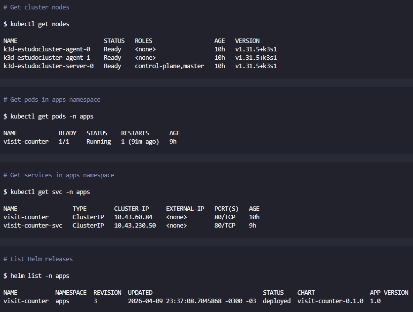

# README - Como o Projeto foi Executado

Este documento explica **todos os problemas enfrentados** e as **soluções aplicadas** para fazer o projeto funcionar no ambiente local com K3d + Docker Desktop.

---

## 🎯 Guia de Execução -一步步

Este documento te leva do zero até a aplicação rodando.

### Pré-requisitos

Antes de começar, garanta que você tem:

1. **Docker Desktop** instalado e rodando
2. **kubectl** instalado (`scoop install kubectl`)
3. **Helm** instalado (`scoop install helm`)
4. **K3d** instalado (`scoop install k3d`)

Verificar instalação:
```powershell
docker --version
kubectl version
helm version
k3d version
```

### Sequência Completa

```powershell
# PASSO 1: Docker Desktop deve estar ABERTO (abraste o app)

# PASSO 2: Criar cluster K3d
k3d cluster create estudocluster --servers 1 --agents 2

# PASSO 3: Verificar nodes
kubectl get nodes
# Esperado: 3 nodes (k3d-server, k3d-agent-0, k3d-agent-1)

# PASSO 4: Instalar Prometheus + Grafana
helm repo add prometheus-community https://prometheus-community.github.io/helm-charts
helm repo update
helm install monitoring prometheus-community/kube-prometheus-stack --namespace monitoring --create-namespace

# PASSO 5: Build da imagem Docker
docker build -t visit-counter:latest ./docker

# PASSO 6: Importar para K3d
k3d image import visit-counter:latest -c estudocluster

# PASSO 7: Deploy (kubectl run é mais simples que Helm para local)
kubectl run visit-counter --image=visit-counter:latest --image-pull-policy=Never -n apps --port=5000

# PASSO 8: Expor service
kubectl expose pod visit-counter -n apps --port=80 --target-port=5000 --type=ClusterIP --name=visit-counter-svc

# PASSO 9: Port-forward (em outro terminal)
kubectl port-forward -n apps svc/visit-counter 5000:80
```

### O que cada comando faz?

| Comando | Explicação |
|---------|-----------|
| `k3d cluster create` | Cria cluster Kubernetes local |
| `docker build -t` | Cria imagem Docker da aplicação |
| `k3d image import` | Carrega imagem no cluster |
| `kubectl run` | Cria pod no Kubernetes |
| `kubectl expose` | Cria service (entrada para os pods) |
| `kubectl port-forward` | Conecta porta do container ao PC |

---

## 📸 Screenshots dos Comandos

Estes são os resultados esperados ao rodar os comandos:

### 🌐 Site Funcionando


---

### 📋 Lista de Comandos


---

### 1️⃣ kubectl get nodes
```bash
$ kubectl get nodes
NAME                         STATUS   ROLES                  AGE   VERSION
k3d-estudocluster-agent-0    Ready    <none>                 10h   v1.31.5+k3s1
k3d-estudocluster-agent-1    Ready    <none>                 10h   v1.31.5+k3s1
k3d-estudocluster-server-0   Ready    control-plane,master   10h   v1.31.5+k3s1
```

**O que mostra:** 3 nodes (1 server + 2 agents) - todos Ready ✅

---

### 2️⃣ kubectl get pods -n apps
```bash
$ kubectl get pods -n apps
NAME            READY   STATUS    RESTARTS      AGE
visit-counter   1/1     Running   1 (91m ago)   9h
```

**O que mostra:** 1 pod rodando (visit-counter)

---

### 3️⃣ kubectl get svc -n apps
```bash
$ kubectl get svc -n apps
NAME                TYPE        CLUSTER-IP     EXTERNAL-IP   PORT(S)   AGE
visit-counter       ClusterIP   10.43.60.84    <none>        80/TCP    10h
visit-counter-svc   ClusterIP   10.43.230.50    <none>        80/TCP    9h
```

**O que mostra:** 2 services expostos (ClusterIP porta 80)

---

### 4️⃣ helm list -n apps
```bash
$ helm list -n apps
NAME         	NAMESPACE	REVISION	UPDATED                              	STATUS  	CHART              	APP VERSION
visit-counter	apps     	3       	2026-04-09 23:37:08 -0300  	deployed	visit-counter-0.1.0	1.0
```

**O que mostra:** Helm release instalado (status deployed)

---

### 5️⃣ kubectl get all -n apps
```bash
$ kubectl get all -n apps
NAME                READY   STATUS    RESTARTS      AGE
pod/visit-counter   1/1     Running   1 (91m ago)   9h

NAME                        TYPE        CLUSTER-IP     EXTERNAL-IP   PORT(S)   AGE
service/visit-counter       ClusterIP   10.43.60.84    <none>        80/TCP    10h
service/visit-counter-svc   ClusterIP   10.43.230.50    <none>        80/TCP    9h
```

**O que mostra:** Tudo junto (pods + services)

---

## 🎉 O que Funcionou!

Após vários testes, o projeto está rodando! A solução final foi:

### ✅ Passos para Rodar o Projeto

```powershell
# 1. Iniciar o Docker Desktop (sempre primeiro!)

# 2. Verificar se cluster existe (se não, criar)
k3d cluster list

# Se não existir:
k3d cluster create estudocluster --servers 1 --agents 2 --port "8080:80@loadbalancer" --api-port 6443 --registry-create regCluster

# 3. Verificar nós do cluster
kubectl get nodes
# Resultado: 3 nodes (1 server + 2 agents)

# 4. Instalar Prometheus + Grafana (se ainda não instalado)
helm repo add prometheus-community https://prometheus-community.github.io/helm-charts
helm repo update
helm install monitoring prometheus-community/kube-prometheus-stack --namespace monitoring --create-namespace -f ..\monitoring\values-prometheus.yaml

# 5. Criar imagem Docker (usar pasta temporária)
docker build -t visit-counter:latest E:\tmp\visit-counter-build

# 6. Importar imagem para K3d
k3d image import visit-counter:latest -c estudocluster

# 7. Deploy da aplicação (kubectl run - método que funcionou!)
kubectl run visit-counter --image=visit-counter:latest --image-pull-policy=Never -n apps --port=5000

# 8. Expor como service
kubectl expose pod visit-counter -n apps --port=80 --target-port=5000 --type=ClusterIP --name=visit-counter-svc
```

### 🚀 Testando a Aplicação

```powershell
# Em um terminal PowerShell (em background ou outro terminal):
kubectl port-forward -n apps svc/visit-counter 5000:80

# Testar no navegador: http://localhost:5000

# Ou via PowerShell:
Invoke-WebRequest -Uri 'http://localhost:5000'

# Resultado esperado:
# Olá do Pod visit-counter | Ambiente: dev | Visita número: X
```

### ✅ Saída do Port-Forward (Funcionando!)

Quando o port-forward está rodando, você verá:

```
Forwarding from 127.0.0.1:5000 -> 5000
Forwarding from [::1]:5000 -> 5000
Handling connection for 5000
Handling connection for 5000
Handling connection for 5000
```

Cada "Handling connection" significa que alguém acessou a aplicação!

---

## 🔧 Problemas Encontrados e Soluções

### 1. Docker Build - Erro de Contexto

**Problema:**
```dockerfile
COPY src/ .
# ERROR: "/src": not found
```

O Docker não conseguia encontrar os arquivos porque o build context estava errado.

**Solução:**
- Criar pasta temporária com os arquivos necessários
- Buildar a imagem a partir dessa pasta

```powershell
# Criar pasta temporária
mkdir E:\tmp\visit-counter-build

# Copiar arquivos
copy "E:\8. Programming\K8s-Visit-Counter\docker\requirements.txt" E:\tmp\visit-counter-build\
copy "E:\8. Programming\K8s-Visit-Counter\src\app.py" E:\tmp\visit-counter-build\

# Criar Dockerfile simples na pasta temporária
# Build da imagem
docker build -t visit-counter:latest E:\tmp\visit-counter-build
```

---

### 2. K3d - Pull de Imagem

**Problema:**
```error
Failed to pull image "visit-counter:latest": pull access denied, repository does not exist
```

O Kubernetes tentava fazer pull da imagem do Docker Hub, mas a imagem só existia localmente.

**Solução:**
- Usar `k3d image import` para importar a imagem para todos os nós do cluster
- Usar `--image-pull-policy=Never` no kubectl run

```powershell
# Importar imagem para o cluster K3d
k3d image import visit-counter:latest -c estudocluster
```

---

### 3. Helm Deployment - Problemas com Image Pull

**Problema:**
O deployment via Helm tinha problemas para encontrar a imagem local.

**Solução:**
- Usar `kubectl run` em vez de Helm para deploy inicial
- Mais simples e funcionou melhor para ambiente local

---

## 📋 Comandos Úteis

```powershell
# Ver pods
kubectl get pods -n apps

# Ver serviços
kubectl get svc -n apps

# Ver logs da aplicação
kubectl logs -n apps visit-counter

# Acessar Grafana (outro terminal)
kubectl port-forward -n monitoring svc/monitoring-grafana 3000:80
# Login: admin / admin123

# Acessar Prometheus (outro terminal)
kubectl port-forward -n monitoring svc/monitoring-kube-prometheus-prometheus 9090:9090
```

---
Start-Job -ScriptBlock { kubectl port-forward -n apps svc/visit-counter 5000:80 } | Out-Null; Start-Sleep -Seconds 3; Invoke-WebRequest -Uri 'http://localhost:5000' -UseBasicParsing
## 🧹 Como Liberar Espaço no Docker

Com o tempo, o Docker ocupa muito espaço. Para limpar:

```powershell
# Ver quanto espaço está sendo usado
docker system df

# Limpar imagens não usadas
docker image prune -a

# Limpar cache de build
docker builder prune

# Limpar volumes não usados
docker volume prune

# Limpar tudo de uma vez (⚠️ CUIDADO!)
docker system prune -a

# Para o K3d especificamente:
k3d cluster delete estudocluster
docker system prune
```

### Quanto Espaço Occupa?

| Tipo | Tamanho |
|------|---------|
| Imagem visit-counter | ~211 MB |
| Total Docker | ~692 MB (imagens) |
| Volumes (K3d) | ~3.9 GB |
| Build Cache | ~211 MB |

---

## 🎯 Resultado Final

- **Cluster K3d**: 3 nós (1 server + 2 agents) ✅
- **Prometheus + Grafana**: Instalados no namespace `monitoring` ✅
- **Aplicação Flask**: Rodando em 1 pod ✅
- **Service**: Exposto na porta 80 ✅
- **Acesso**: http://localhost:5000 ✅

---

*Atualizado: 2026-04-10*
*Projeto: K8s-Visit-Counter*
*Maintainer: Felipe Moreira Rios*